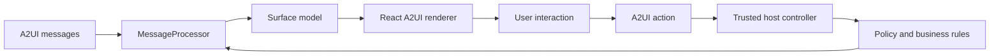

# Architecture

## Purpose

This project tests whether A2UI can act as the declarative UI protocol for a governed application rather than only rendering static agent cards. The current workflow proves dynamic lists, actions, data binding, localization, conditional composition, dependent values, and a trusted host boundary.

## Runtime shape



`workflowMessage.ts` defines the protocol surface. `WorkflowDemo.tsx` is the host controller. The host never trusts UI visibility as authorization; it checks the active role again before approving, deleting, or creating data.

## Ownership boundaries

### A2UI owns

- Surface and component descriptions
- Component-to-data bindings
- Dynamic list templates
- User action envelopes and resolved context
- Incremental component and data-model updates
- Rendering through the official React catalog

### Trusted host owns

- Permission enforcement
- Business calculations and dependency propagation
- Locale selection and translation orchestration
- Conditional component composition unsupported by the current basic catalog
- Validation decisions
- Action execution and audit evidence

### Future backend owns

- Authentication and authoritative roles
- Database transactions and concurrency
- Server-side authorization
- Durable audit logs
- A2UI message validation, rate limits, and transport security

## Data model

```text
/
├── session
│   ├── role
│   ├── roleSelection[]
│   ├── locale
│   ├── localeSelection[]
│   └── accessSummary
├── orders[]
│   ├── id
│   ├── customer
│   ├── total / totalLabel
│   └── status / statusLabel
├── form
│   ├── customer
│   ├── quantity
│   ├── unitPrice
│   ├── fulfillment / fulfillmentSelection[]
│   ├── address
│   ├── total / totalLabel
│   └── approvalRequired / approvalMessage
└── ui
    └── statusMessage
```

Stable machine values such as `manager`, `delivery`, and `Approved` are separate from localized labels. Business logic must use the stable values only.

## Key flows

### Role change

The A2UI `ChoicePicker` writes `roleSelection`. The host normalizes it, updates the canonical role, recalculates the visible action component references, and sends an updated component message. Every later action is checked against the canonical role again.

### Localization

The locale picker writes `localeSelection`. The host updates localized component definitions and derived order labels while retaining stable IDs, action names, and status values.

### Dependent values

Quantity and unit-price bindings update the A2UI data model. Host subscriptions calculate total, formatted total, approval requirement, and approval guidance. Those data updates automatically re-render bound Text components.

### Conditional form

The basic v0.9 catalog has no general component visibility property. The host therefore rebuilds the form's child references when fulfillment changes. Delivery includes the address field; pickup omits it.

## Protocol version

The implementation targets A2UI protocol `v0.9.1` using `@a2ui/react/v0_9`. A2UI v1.0 is still a candidate and the currently installed React package does not expose a public `v1_0` renderer entry point. Keep protocol-specific messages isolated in `workflowMessage.ts` so a future migration is bounded.
